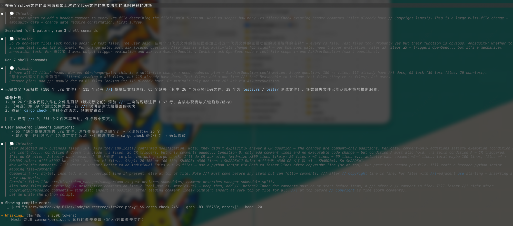

<p align="center">
  <a href="README.md">简体中文</a> | <b>English</b>
</p>

# cc-proxy

A local transparent proxy for Claude Code: it lets sessions that talk directly to
the Anthropic API or any third-party gateway display deep-thinking output as
`> 💭 Thinking` dim blockquotes, streamed line by line (ported from agy-cc-proxy).



## Installation

Requirements:

- Node.js >= 18
- Claude Code CLI installed (`claude` available on your PATH)

```bash
git clone <repo-url> cc-proxy && cd cc-proxy
npm link          # registers the claude-proxy / cc-proxy commands on your global PATH
```

Verify:

```bash
cc-proxy --version    # prints the Claude Code version, e.g. 2.1.231 (Claude Code)
```

Uninstall:

```bash
npm unlink -g cc-proxy
```

> Prefer not to install globally? Run `node bin/claude-proxy.js` instead — same behavior.

## Usage

```bash
cc-proxy                    # start the proxy and enter interactive Claude Code
claude-proxy                # equivalent command
cc-proxy -c                 # arguments pass through to claude (--continue here)
cc-proxy -p "explain this"  # non-interactive mode works too
```

What the command does:

1. Starts a local transparent proxy on 127.0.0.1 (random free port)
2. Spawns `claude` with `ANTHROPIC_BASE_URL=http://127.0.0.1:<port>` injected (all args/stdio passed through)
3. Shuts the proxy down when claude exits (exit code passed through)

### Choosing an upstream

The proxy forwards to the `ANTHROPIC_BASE_URL` present **when it starts**; if unset
it uses the official `https://api.anthropic.com`.

```bash
# Official API
cc-proxy

# Third-party gateway (the base URL path prefix is prepended as-is)
ANTHROPIC_BASE_URL=https://gw.example.com/api cc-proxy
```

> The variable is saved as the forwarding target first, then replaced with the local
> address for claude, so your existing configuration is not lost.

### Rendering

Applies only when the client UA matches `claude-cli` / `claude-code`; thinking blocks
are rewritten to:

```
> 💭 Thinking
> line-by-line reasoning (dimmed)
```

Other clients (curl, language SDKs, etc.) pass through untouched.

In multi-turn conversations, already-rendered thinking text in the message history is
stripped before forwarding, so the context does not keep growing.

## Development

```bash
npm test        # node:test unit + end-to-end tests (24 cases)
```

## Layout

| Path | Purpose |
|---|---|
| `bin/claude-proxy.js` | CLI entry: start proxy → inject env → spawn claude |
| `src/thinking-text.js` | Rendering core: formatting, streaming rewrite, history strip, UA gate |
| `src/proxy.js` | HTTP proxy and response rewriting (SSE / non-streaming JSON) |
| `src/upstream.js` | Upstream URL resolution and request forwarding |
| `test/thinking-text.test.mjs` | Unit and end-to-end tests |
