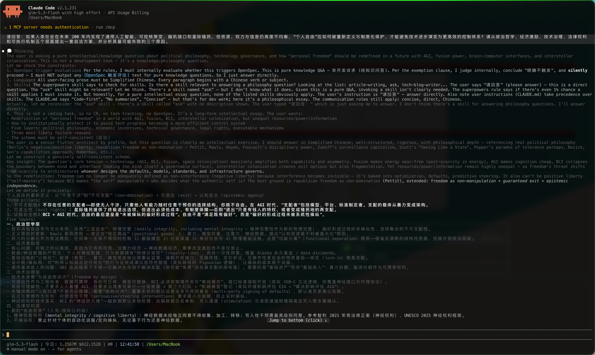

# 我给 Claude Code 写了个本地代理，就为了看清它的"内心戏"

> 一个零依赖的 Node.js 小工具，让直连 Anthropic API / 任意第三方网关的 Claude Code 也能流式渲染深度思考过程。开箱即用。
>
> **GitHub：https://github.com/TsinHzl/cc-proxy**

## 一、你有没有遇到过这些糟心时刻？

如果你是 Claude Code 的重度用户，下面这些场景大概率似曾相识：

### 痛点 1：深度思考过程"黑盒"，只能干等

Claude Code 开启 Extended Thinking 后，模型会先进行一段深度推理再给出答案。但当你**直连 Anthropic API**，或者通过**第三方网关 / 中转站**使用时，界面上一片寂静——思考过程完全不显示，屏幕空白十几秒到几分钟，你根本不知道：

- 它是在认真推理，还是卡死了？
- 它理解对了我的需求吗？方向跑偏了没有？
- 这漫长的等待，到底在想什么？

方向错了你也发现不了，只能等它把一整坨代码写完、跑完测试，才发现从一开始就理解错了。**时间全浪费在返工上。**

### 痛点 2：中转站把 thinking 块"吃掉"了

很多人实际在用第三方 API 网关（价格更低、国内可达）。但部分中转实现会把 `thinking` 内容块丢弃或降级，Claude Code 官方 UI 又只认 thinking 块的渲染——结果就是：**你的套餐明明包含 thinking 额度，你却永远看不到它在想什么。**

### 痛点 3：官方订阅之外，没有轻量的替代方案

你可能会想：改 Claude Code 源码？不现实，版本一升级就白干。换官方订阅？成本直接翻几倍。找一个重型的网关服务？为了看个思考过程，引入一整套中间件，太重了。

**我只是想看一眼它在想什么，有这么难吗？**

## 二、cc-proxy：一个本地小代理，把"内心戏"投屏给你看

[cc-proxy](https://github.com/TsinHzl/cc-proxy) 的思路非常克制：**不改 Claude Code 一行代码，不动上游 API 一个字节，只做一层本地透明代理。**

工作原理三步：

1. 在本机 `127.0.0.1` 起一个随机端口的代理服务
2. 启动 `claude` 命令时注入 `ANTHROPIC_BASE_URL=http://127.0.0.1:<port>`，让 Claude Code 的流量流经代理
3. 代理把响应里的 thinking 块实时转写成文本块，流式渲染成这样：



一行接一行灰色暗显的推理文字实时滚出，`💭 Thinking` 开头——它此刻的每一丝犹豫、每一次自我纠正，你都看得一清二楚。

## 三、为什么值得一试？

### ✅ 真正的"透明"

- 非 Claude Code 客户端（curl、SDK、脚本）的流量**原样透传**，一个字节都不动
- 与 thinking 无关的 SSE 事件**原样透传**
- 请求头、状态码、非流式响应全部保持原样

你不用担心它"多管闲事"破坏任何现有行为，25 个自动化测试专门守护这些不变量。

### ✅ 上下文不膨胀（这是很多人没想到的坑）

思考过程一旦被渲染成对话文本，多轮对话时它会作为历史消息**反复发送给上游**——上下文越聊越大，token 费用悄悄上涨。cc-proxy 在请求侧自动剥离历史中已渲染的思考文本（兼容本工具新旧两种渲染格式），历史干净，账单安心。

### ✅ 零依赖、够轻量

- 纯 Node.js ≥ 18 标准库实现，`node:http` / `node:https` / `child_process`
- **没有一个第三方运行时依赖**，没有 node_modules 黑洞，没有供应链焦虑
- 256KB 单块 / 1MiB 单响应的字节上限保护，超大思考块自动降级丢弃而不是搞崩会话

### ✅ 想用哪就用哪

```bash
# 直连官方 API
cc-proxy

# 第三方网关（base URL 原样透传拼接）
ANTHROPIC_BASE_URL=https://gw.example.com/api cc-proxy
```

环境变量保存在代理侧作为转发目标，再替换成本地地址传给 claude——你现有的配置一点不丢。

## 四、30 秒上手

前置要求：Node.js ≥ 18、已安装 Claude Code CLI。

```bash
git clone https://github.com/TsinHzl/cc-proxy.git && cd cc-proxy
npm link        # 注册 cc-proxy / claude-proxy 命令到全局 PATH
```

然后把你平时敲的 `claude` 换成 `cc-proxy`：

```bash
cc-proxy                    # 启动代理并进入交互式 Claude Code
cc-proxy -c                 # 参数原样透传给 claude（--continue）
cc-proxy -p "解释这段代码"   # 非交互模式同样支持
```

完事。之后每次会话，深度思考都会实时流式呈现在你眼前。

## 五、适合谁？

- **API / 网关用户**：直连 Anthropic API 或任何第三方网关的 Claude Code 用户
- **成本敏感型玩家**：想确认每一分 thinking token 都花在了刀刃上
- **调试强迫症**：无法忍受"它到底在想什么"这个永恒悬念
- **工具链洁癖**：欣赏零依赖、可读完、可审计的小工具

## 六、写在最后

cc-proxy 不是又一个 All-in-One 的全家桶，它只解决一个问题，并把它解决干净：**让 Claude Code 的深度思考在任何接入方式下都能被看见**。

如果你也被"黑盒等待"折磨过，给仓库点个 Star ⭐ 就是最好的支持：

> **GitHub：https://github.com/TsinHzl/cc-proxy**

Issue 和 PR 均欢迎。如果你在某个第三方网关上用出了问题，欢迎提 issue 附上网关信息，我来适配。
